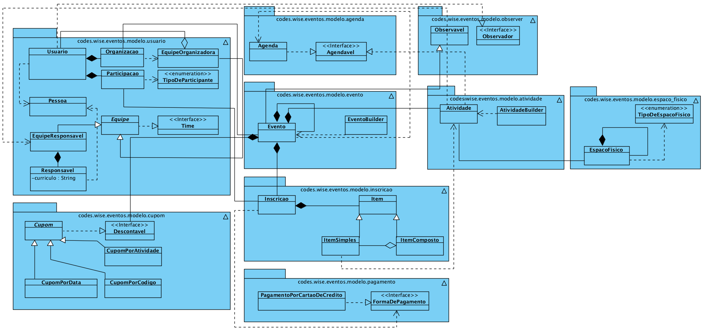

# Projeto Eventos
### Versao 2.0
Implementação de um sistema de controle de eventos proposto pela disciplina Programação Corporativa do curso de Análise e Desenvolvimento de Sistemas - IFPI.

### Diagrama de classes

### Slides
http://slides.com/pierryangelopereira/eventos-v2

### Deploy
Importar como projeto maven no eclipse.

